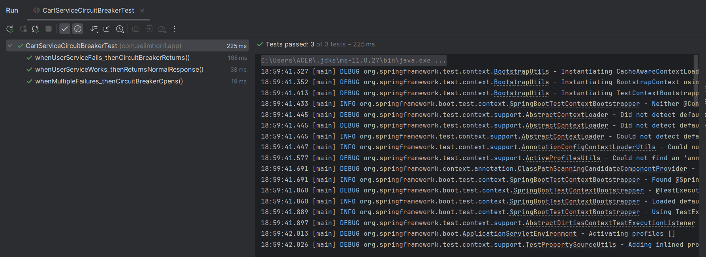
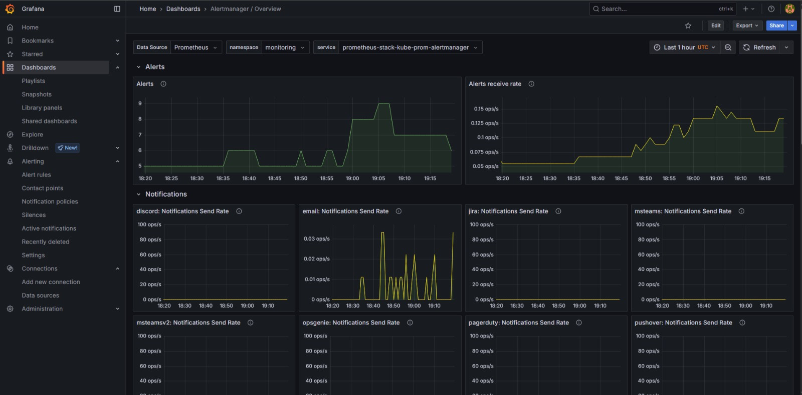

# Metodología Ágil y Estrategia de Branching

##  Metodología Ágil

Para el desarrollo del proyecto se implementó la metodología ágil **Scrum**, utilizando **Jira** como sistema de gestión de proyectos. Esto nos permitió organizar el trabajo en sprints, gestionar historias de usuario, asignar tareas y dar seguimiento al avance del equipo.

### Herramienta de Gestión
- **Jira**: Utilizada para la planificación, seguimiento y documentación de los sprints, historias de usuario y criterios de aceptación.


##  Estrategia de Branching

Se definió y documentó una estrategia de branching basada en **GitFlow**, adaptada a las necesidades del equipo y del proyecto. Los principales branches utilizados fueron:

- **main**: Rama principal, contiene el código estable y listo para producción.
- **dev**: Rama de desarrollo, donde se integran las nuevas funcionalidades antes de pasar a stage.
- **stage**: Rama de pre-producción, utilizada para pruebas integradas antes de pasar a producción.


El flujo de trabajo es el siguiente:
1. Las nuevas funcionalidades y correcciones se desarrollan en ramas feature/ o fix/ a partir de dev.
2. Una vez completadas y revisadas, se integran a dev.
3. Al finalizar un sprint, los cambios de dev se integran en stage para pruebas integradas.
4. Finalmente, tras la validación en stage, los cambios se integran en main para su despliegue en producción.

##  Gestión de Sprints e Historias de Usuario

Se realizaron **dos sprints completos** durante el desarrollo del proyecto, documentando historias de usuario, criterios de aceptación y asignaciones en Jira.

### Sprints Realizados

- **Sprint 1**: Enfocado en la infraestructura, pruebas, monitoreo y CI/CD.
- **Sprint 2**: Enfocado en gestión de cambios, patrones de diseño, seguridad, documentación y operaciones.

### Historias de Usuario 


## Sprint 1

| HU Principal                                  | Subtareas (Resumen)                                                                                                                                    |
| --------------------------------------------- | ------------------------------------------------------------------------------------------------------------------------------------------------------ |
| **Infraestructura como Código con Terraform** | - HU-001: Configuración Multi-ambiente con Terraform  <br> - HU-002: Backend Remoto para Estado de Terraform                                           |
| **CI/CD Avanzado**                            | - HU-005: Análisis Estático Avanzado con SonarQube <br> - HU-006: Escaneo de Vulnerabilidades con Trivy <br> - HU-007: Versionado Semántico Automático |
| **Observabilidad y Monitoreo**                | - HU-008: Stack de Monitoreo con Prometheus y Grafana <br> - HU-009: Gestión de Logs con ELK Stack <br> - HU-010: Tracing Distribuido                  |
| **Pruebas Avanzadas**                         | - HU-011: Pruebas de Seguridad Automatizadas                                                                                                           |

## Sprint 2

| HU Principal                     | Subtareas (Resumen)                                                                                       |
| -------------------------------- | --------------------------------------------------------------------------------------------------------- |
| **Patrones de Diseño Avanzados** | - HU-003: Implementación de Patrón Circuit Breaker <br> - HU-004: Configuración Externa y Feature Toggles |
| **Change Management**            | - HU-012: Sistema de Change Management                                                                    |
| **Seguridad Avanzada**           | - HU-013: Gestión Segura de Secretos <br> - HU-014: RBAC y Seguridad de Accesos                           |
| **Documentación y Operaciones**  | - HU-015: Manual de Operaciones y Documentación                                     |


### Criterios de Aceptación

Cada historia de usuario en Jira cuenta con criterios de aceptación claros y medibles, asegurando que el entregable cumple con los requisitos funcionales y de calidad definidos por el equipo.


---

**Resumen:** 
Se implementó Scrum con Jira, se documentaron y gestionaron historias de usuario y sprints, y se utilizó una estrategia de branching basada en GitFlow con ramas main, dev y stage, cumpliendo con las mejores prácticas de desarrollo ágil y control de versiones.


## Diagrama de infraestructura


##  Cliente y Entrada al Sistema
- **Client:** Los usuarios o sistemas externos interactúan con la plataforma a través de un cliente (navegador, app, etc.).
- **Application Load Balancer:** Todas las peticiones entrantes pasan por un balanceador de carga, que distribuye el tráfico de manera eficiente y asegura alta disponibilidad.

## Ciclo DevOps y Despliegue
- **Jenkins Pipeline:** Automatiza la integración y entrega continua (CI/CD), construyendo, testeando y desplegando los microservicios.
- **Docker Hub:** Almacena las imágenes de los microservicios que serán desplegadas en el clúster de Kubernetes.

## Orquestación y Ejecución
- **Google Kubernetes Engine (GKE):** Es la plataforma de orquestación de contenedores donde se ejecutan todos los microservicios y componentes del sistema.

## Arquitectura de Microservicios
- **API Gateway:** Punto de entrada único para todas las peticiones internas y externas, gestionando el enrutamiento, autenticación y balanceo de carga hacia los microservicios.
- **Service Discovery:** Permite que los microservicios se registren y descubran dinámicamente, facilitando la escalabilidad y resiliencia.
- **Proxy Client:** Abstrae la comunicación entre microservicios, gestionando detalles como reintentos y circuit breakers.
- **Circuit Breaker:** Protege el sistema ante fallos, evitando que errores en un servicio afecten a los demás.
- **Zipkin:** Proporciona trazabilidad distribuida, permitiendo rastrear el flujo de las peticiones entre los servicios.

### Microservicios Principales
- **User-Service, Product-Service, Order-Service, Payment-Service:** Cada uno implementa una funcionalidad de negocio específica y se comunica con los demás a través del API Gateway y el Proxy Client.

## Monitoreo y Observabilidad
- **Prometheus:** Recopila métricas de los microservicios y la infraestructura.
- **Grafana:** Visualiza las métricas recolectadas y permite crear dashboards personalizados.
- **Alerts:** Grafana puede generar alertas automáticas ante eventos críticos o anomalías detectadas en el sistema.

##  Logs y Trazabilidad
- **Elasticsearch, Logstash, Kibana (ELK Stack):**
  - **Logstash:** Recolecta y procesa logs de los microservicios.
  - **Elasticsearch:** Almacena y permite búsquedas rápidas sobre los logs.
  - **Kibana:** Visualiza los logs y facilita el análisis y monitoreo.

##  Mensajería y Procesamiento Asíncrono
- **Kafka:** Permite la comunicación asíncrona y desacoplada entre microservicios, facilitando la escalabilidad y el procesamiento de eventos en tiempo real.


 Ambientes Definidos

El ciclo de vida del software se gestiona a través de tres ambientes principales:

- **dev:** Espacio seguro para experimentación y desarrollo individual.
- **stage:** Entorno de integración y pruebas end-to-end, simula condiciones de producción.
- **master (producción):** Entorno estable y seguro, donde se ejecuta la versión aprobada del sistema.


Cada ambiente cuenta con configuración propia y pipelines de CI/CD dedicados, permitiendo despliegues independientes y controlados.


## Estructura del proyecto

```
proyecto-infra/
├── main.tf                  # Configuración principal - orquesta módulos
├── variables.tf             # Variables globales del proyecto
├── providers.tf             # Configuración del provider de Google Cloud
├── backend.tf               # Estado remoto en Google Cloud Storage
├── outputs.tf               # Outputs principales del proyecto
├── terraform.tfvars         # Variables por defecto
├── versions.tf              # Versiones de Terraform y providers
│
├── environments/            # Configuraciones específicas por ambiente
│   ├── dev/
│   │   ├── backend.tf           # Backend específico para desarrollo
│   │   └── terraform.tfvars     # Variables para ambiente de desarrollo
│   ├── stage/
│   │   ├── backend.tf           # Backend específico para staging
│   │   └── terraform.tfvars     # Variables para ambiente de staging
│   └── prod/
│       ├── backend.tf           # Backend específico para producción
│       └── terraform.tfvars     # Variables para ambiente de producción
│
└── modules/                   # Módulos reutilizables
    ├── vpc/                   # Módulo de red VPC
    │   ├── main.tf                # Recursos de red (VPC + Subnetwork)
    │   ├── variables.tf           # Variables del módulo VPC
    │   └── outputs.tf             # Outputs del módulo VPC
    ├── gke/                   # Módulo de Kubernetes
    │   ├── main.tf                # Recursos GKE (Cluster + Node Pool)
    │   ├── variables.tf           # Variables del módulo GKE
    │   └── outputs.tf             # Outputs del módulo GKE
    ├── artifact-registry/      # Módulo de Artifact Registry
    │   ├── main.tf                # Recursos de Artifact Registry
    │   ├── variables.tf           # Variables del módulo Artifact Registry
    │   └── outputs.tf             # Outputs del módulo Artifact Registry
    └── monitoring/             # Módulo de Monitoring
        ├── main.tf                  # Recursos de Monitoring (alertas, dashboards, etc.)
        ├── variables.tf             # Variables del módulo Monitoring
        └── outputs.tf               # Outputs del módulo Monitoring

    
```

## Patrones de Diseño en la Arquitectura de Microservicios

### Patrones de Diseño Identificados en la Arquitectura Existente

###  Microservicios

La arquitectura está basada en microservicios, donde cada funcionalidad principal (usuario, producto, pago, etc.) es un servicio independiente, desplegado y escalado de forma autónoma.
 
- Servicios como `user-service`, `product-service`, `payment-service`, etc., cada uno con su propio Dockerfile y despliegue.
- Uso de un `api-gateway` y `service-discovery` (Eureka).

###  Service Discovery 

Se utiliza un servicio de descubrimiento (Eureka) para que los microservicios puedan encontrarse y comunicarse dinámicamente sin necesidad de conocer las direcciones de los demás de antemano.

- Despliegue de `service-discovery` (Eureka).
- Variables de entorno como `EUREKA_CLIENT_SERVICE_URL_DEFAULTZONE` en los contenedores de los microservicios.

###  Externalized Configuration 

La configuración de los microservicios se externaliza usando un servidor de configuración centralizado (`cloud-config`), permitiendo cambiar configuraciones sin necesidad de reconstruir las imágenes.

- Despliegue de `cloud-config`.
- Uso de variables como `SPRING_CONFIG_IMPORT=optional:configserver:http://cloud-config-container:9296`.

###  Centralized Logging & Tracing

Se utiliza Zipkin para trazabilidad distribuida, permitiendo rastrear peticiones a través de los microservicios.
 
- Despliegue de `zipkin`.
- Variables de entorno como `SPRING_ZIPKIN_BASE_URL`.


## Patrones de Diseño Implementados

A continuación se documentan los patrones de diseño implementados en la arquitectura del proyecto, junto con su propósito, beneficios y un fragmento de código representativo de cada uno.


###  Circuit Breaker 

**Propósito:**  
El patrón Circuit Breaker protege a los microservicios de fallos en cascada cuando una dependencia está fallando o responde lentamente. Si detecta varios fallos consecutivos, "abre el circuito" y deja de intentar la operación durante un tiempo, devolviendo un error inmediato.

**Beneficios:**
- Previene la sobrecarga de servicios fallando repetidamente.
- Mejora la resiliencia y estabilidad del sistema.
- Permite una recuperación más rápida y controlada tras un fallo.

**Implementación (usando Resilience4j):**
```java
@CircuitBreaker(name = "userService", fallbackMethod = "fallbackGetUser")
public UserDto getUserById(Integer userId) {
    return restTemplate.getForObject("http://USER-SERVICE/api/users/" + userId, UserDto.class);
}

public UserDto fallbackGetUser(Integer userId, Throwable t) {
    // Lógica alternativa cuando el circuito está abierto o falla la llamada
    return new UserDto(); // o retorna un mensaje de error personalizado
}
```




---

### Feature Toggle

**Propósito:**  
Permite activar o desactivar funcionalidades del sistema en tiempo real, sin necesidad de desplegar una nueva versión, mediante configuración externa.

**Beneficios:**
- Permite despliegues seguros y pruebas A/B.
- Reduce riesgos al habilitar nuevas funcionalidades de forma controlada.
- Mejora la flexibilidad operativa.

**Implementación (usando configuración externa):**
```java
@Value("${feature.toggle.newProductFeature:false}")
private boolean newProductFeatureEnabled;

@GetMapping("/new-feature")
public ResponseEntity<String> newFeatureEndpoint() {
    if (!newProductFeatureEnabled) {
        return ResponseEntity.status(HttpStatus.NOT_IMPLEMENTED)
            .body("Funcionalidad no disponible");
    }
    // Lógica de la nueva funcionalidad
    return ResponseEntity.ok("Nueva funcionalidad activa");
}
```
> El valor de `feature.toggle.newProductFeature` se puede cambiar en el servidor de configuración (`cloud-config`) y recargar dinámicamente.


---

###Retry 

**Propósito:**  
Permite que los microservicios reintenten automáticamente una operación que ha fallado temporalmente antes de devolver un error.

**Beneficios:**
- Mejora la tolerancia a fallos transitorios.
- Reduce la cantidad de errores visibles para el usuario final.
- Aumenta la robustez y confiabilidad de las operaciones críticas.

**Implementación (Spring Retry):**
```java
@Retryable(
    value = { ProductNotFoundException.class },
    maxAttempts = 3,
    backoff = @Backoff(delay = 1000)
)
public ProductDto findById(final Integer productId) {
    log.info("*** ProductDto, service; fetch product by id *");
    return this.productRepository.findById(productId)
        .map(ProductMappingHelper::map)
        .orElseThrow(() -> new ProductNotFoundException(
            String.format("Product with id: %d not found", productId)));
}
```
> Si la búsqueda falla, el método se reintentará hasta 3 veces antes de lanzar la excepción.


## CI/CD Avanzado

###  Análisis Estático de Código con SonarQube

Se integró SonarQube en la pipeline para realizar análisis estático de código en cada build. El análisis se ejecuta automáticamente y la pipeline puede fallar si no se cumplen los umbrales de calidad.

**Fragmento de Jenkinsfile:**
```groovy
 stage('Run SonarQube Analysis') {
     steps {
         withSonarQubeEnv(credentialsId: 'access_sonarqube', installationName: 'sonarqubesecae') {
             bat "${scannerHome}/bin/sonar-scanner " +
                 "-Dsonar.projectKey=${service} " +
                 "-Dsonar.projectName=${service} " +
                 '-Dsonar.sources=src ' +
                 '-Dsonar.java.binaries=target/classes'
         }
     }
 }
```
> Este stage ejecuta el análisis de SonarQube para cada microservicio, usando el scanner oficial y variables de entorno seguras.


#### **Interpretación de los resultados de SonarQube**

Las imágenes muestran el dashboard de SonarQube tras los análisis automáticos de los microservicios.  
- **Todos los microservicios analizados han pasado el Quality Gate** (indicador verde "Passed"), lo que significa que cumplen con los umbrales de calidad definidos para seguridad, mantenibilidad y fiabilidad.
- **No se detectaron issues de seguridad, fiabilidad ni mantenibilidad** (todos los indicadores en "A").
- **Cobertura de código y duplicación:** En los ejemplos mostrados, la cobertura de tests es 0% en algunos servicios, lo que indica que no se han instrumentado tests automáticos o no se han reportado correctamente. Sin embargo, no hay duplicación de código.
- **Resumen:** El código es seguro, confiable y mantenible según SonarQube, pero se recomienda mejorar la cobertura de tests para mayor robustez.

---

## Escaneo de Vulnerabilidades en Contenedores con Trivy

Se implementó un stage dedicado para escanear las imágenes Docker de todos los microservicios usando Trivy. Si se detectan vulnerabilidades críticas, la pipeline puede detenerse.

**Fragmento de Jenkinsfile:**
```groovy
stage('Trivy Vulnerability Scan & Report') {
    when { branch 'stage' }
    environment {
        TRIVY_PATH = 'C:/ProgramData/chocolatey/bin'
    }
    steps {
        script {
            env.PATH = "${TRIVY_PATH};${env.PATH}"
            def services = [ ... ]
            bat """
            if not exist trivy-reports (
                mkdir trivy-reports
            )
            """
            services.each { service ->
                def reportPath = "trivy-reports\\${service}.html"
                echo "🔍 Escaneando imagen ${IMAGE_TAG} con Trivy para ${service}..."
                bat """
                trivy image --format template ^
                    --template "@C:/ProgramData/chocolatey/lib/trivy/tools/contrib/html.tpl" ^
                    --severity HIGH,CRITICAL ^
                    -o ${reportPath} ^
                    ${DOCKERHUB_USER}/${service}:${IMAGE_TAG}
                """
            }
            publishHTML(target: [
                allowMissing: true,
                alwaysLinkToLastBuild: true,
                keepAll: true,
                reportDir: 'trivy-reports',
                reportFiles: '*.html',
                reportName: 'Trivy Scan Report'
            ])
        }
    }
}
```
> Este stage escanea todas las imágenes y publica un reporte HTML con los resultados de Trivy.


#### **resultados de Trivy**

La imagen muestra un reporte generado por Trivy para la imagen Docker de `api-gateway`.  
- **Se detectan varias vulnerabilidades críticas y altas** en paquetes del sistema base (por ejemplo, `curl` y `bash`).
- **Columnas clave:**  
  - **Severity:** Indica el nivel de criticidad (CRITICAL/HIGH).
  - **Installed Version / Fixed Version:** Muestra la versión instalada y la versión donde el problema está corregido.
  - **Links:** Proporciona enlaces a los reportes oficiales de cada vulnerabilidad (CVE).
- **Acción recomendada:**  
  - Actualizar la imagen base a una versión más reciente donde las vulnerabilidades estén corregidas.
  - Si no es posible, evaluar el riesgo y aplicar mitigaciones (por ejemplo, restringir el uso de los paquetes afectados).

- **Resumen:** El escaneo de Trivy es fundamental para asegurar que las imágenes Docker no contienen vulnerabilidades conocidas. El pipeline puede configurarse para fallar automáticamente si se detectan vulnerabilidades críticas, evitando así la promoción de imágenes inseguras a producción.

---

##  Notificaciones Automáticas de Fallos

La pipeline está configurada para enviar notificaciones automáticas por correo electrónico en caso de fallo en cualquier etapa.

**Fragmento de Jenkinsfile:**
```groovy
post {
    failure {
        echo "❌ Falló pipeline en ${env.BRANCH_NAME}. Ver logs."
        emailext(
            attachLog: true,
            body: '$DEFAULT_CONTENT',
            subject: '$DEFAULT_SUBJECT',
            to: '$DEFAULT_RECIPIENTS',
        )
    }
}
```
> Si la pipeline falla, se envía un correo con el log adjunto a los destinatarios configurados.

---

## 4. Aprobaciones para Despliegues a Producción

Antes de desplegar a producción, se requiere una aprobación manual desde la interfaz de Jenkins. Además, se notifica por correo que la build está pendiente de aprobación.

**Fragmento de Jenkinsfile:**
```groovy
 stage('Waiting approval for deployment') {
     when { branch 'master' }
     steps {
         script {
             emailext(
                 to: '$DEFAULT_RECIPIENTS',
                 subject: "Action Required: Approval Needed for Deploy of Build #${env.BUILD_NUMBER}",
                 body: """\
                 The build #${env.BUILD_NUMBER} for branch *${env.BRANCH_NAME}* has completed and is pending approval for deployment.
                 Please review the changes and approve or abort
                 You can access the build details here:
                 ${env.BUILD_URL}
                 """
             )
             input message: 'Approve deployment to production (kubernetes) ?', ok: 'Deploy'
         }
     }
 }
```
> Este stage envía un correo solicitando aprobación y detiene la pipeline hasta que un responsable apruebe el despliegue.

## Notificaciones automáticas para fallos en la pipeline


---

## Informe de Cobertura y Calidad de Pruebas

Se muestra qué porcentaje del código fuente es ejecutado por los tests automáticos. Las métricas principales son:

- **Cobertura de instrucciones:** Porcentaje de líneas de código ejecutadas por los tests.
- **Cobertura de ramas:** Porcentaje de bifurcaciones (if, else, switch, etc.) ejecutadas.
- **Cobertura por clases/métodos:** Porcentaje de clases y métodos ejecutados al menos una vez por los tests.

---


###  Informe de cobertura: `product-service`

| Métrica                       | Valor                        |
|-------------------------------|------------------------------|
| Cobertura de instrucciones    | **85%** (2,147 de 2,514)     |
| Cobertura de ramas            | **100%** (276 de 276)        |
| Clases cubiertas              | 15 de 26                     |
| Métodos cubiertos             | 160 de 218                   |
| Tests fallidos                | 0                            |

**Observaciones:**
- Los paquetes `com.selimhorri.app.dto` y `com.selimhorri.app.exception.payload` tienen menor cobertura (21% y 18% respectivamente).
- Otros paquetes como `resource`, `service.impl`, `helper`, etc., tienen 0% de cobertura, lo que indica que no están siendo probados por los tests.
- La mayoría de los métodos y líneas están cubiertos, pero hay áreas de mejora en DTOs y excepciones.

---


###  Informe de cobertura: `user-service`

| Métrica                       | Valor                        |
|-------------------------------|------------------------------|
| Cobertura de instrucciones    | **20%** (3,878 de 4,854)     |
| Cobertura de ramas            | **97%** (494 de 512)         |
| Clases cubiertas              | 30 de 43                     |
| Métodos cubiertos             | 297 de 395                   |
| Tests fallidos                | 0                            |

**Observaciones:**
- La cobertura es significativamente más baja que en `product-service`.
- Los paquetes `dto` y `resource` tienen coberturas bajas (29% y 6% respectivamente).
- Hay muchos métodos y líneas no cubiertas, especialmente en DTOs y helpers.
- Se recomienda aumentar la cobertura en los paquetes críticos para mejorar la calidad y detectar errores antes.

---


### Resultados de los tests

| Paquete                                 | Duración | Fallidos | Pasados | Total |
|------------------------------------------|----------|----------|---------|-------|
| com.selimhorri.app.integration          | 16 seg   | 0        | 7       | 7     |
| com.selimhorri.app.unit                  | 3.3 seg  | 0        | 6       | 6     |
| com.selimhorri.app.unit.service          | 4.5 seg  | 0        | 12      | 12    |
| **Total**                               | 2:49 min | **0**    | **25**  | **25**|

Todos los tests existentes pasan correctamente, lo que indica que el código cubierto por los tests funciona como se espera. Sin embargo, la baja cobertura en algunos servicios (especialmente en `user-service`) sugiere que hay partes del código que no están siendo probadas y podrían contener errores no detectados.

---

### Conclusión y recomendaciones

- **Cobertura alta (`product-service`):** Es buena (85%), pero aún hay áreas (DTOs, excepciones) que pueden mejorarse.
- **Cobertura baja (`user-service`):** Es baja (20%), lo que representa un riesgo. Se recomienda crear más tests, especialmente para los paquetes con menor cobertura.
- **Calidad de pruebas:** Todos los tests pasan, pero la calidad general


## Change Management y Planes de Rollback

###  Proceso Formal de Change Management

El proceso de Change Management asegura que todos los cambios en la arquitectura, código o infraestructura sean gestionados de manera controlada, minimizando riesgos y garantizando la trazabilidad.

### Fases del Proceso

 **Solicitud de Cambio (RFC - Request for Change)**
   - Todo cambio debe ser propuesto mediante un issue o ticket en el sistema de gestión de proyectos (por ejemplo, GitHub Issues, Jira).
   - La solicitud debe incluir: descripción, justificación, impacto esperado, riesgos y plan de pruebas.

 **Evaluación y Aprobación**
   - El equipo de desarrollo y/o arquitecto revisa la solicitud.
   - Se evalúan riesgos, dependencias y se prioriza el cambio.
   - Si es aprobado, se asigna a un responsable y se planifica en el sprint correspondiente.

 **Desarrollo y Pruebas**
   - El cambio se implementa en una rama específica.
   - Se realizan pruebas unitarias, de integración y, si aplica, pruebas de carga.
   - Se documentan los resultados en el pull request.

 **Revisión y Validación**
   - Code review obligatorio por al menos un miembro del equipo.
   - Validación en ambiente de staging/pre-producción.

 **Despliegue Controlado**
   - El cambio se despliega usando pipelines automatizados (CI/CD).
   - Se monitorea el sistema tras el despliegue para detectar posibles incidencias.

 **Documentación y Comunicación**
   - Se actualizan los documentos técnicos y de usuario.
   - Se comunica el cambio a los stakeholders mediante Release Notes.

 **Cierre**
   - Se cierra la solicitud de cambio y se archiva la documentación asociada.


##  Planes de Rollback


El plan de rollback define los pasos a seguir para revertir un despliegue en caso de que se detecten problemas críticos tras la liberación de una nueva versión.

### Estrategia General

- **Despliegue Blue/Green o Canary:** Mantener la versión anterior activa hasta validar la nueva.
- **Backups:** Realizar backups de bases de datos y configuraciones antes de cada despliegue.
- **Automatización:** Usar scripts o pipelines para revertir a la versión anterior de los servicios y configuraciones.

### Pasos para Rollback

 **Identificación del Problema**
   - Monitorear logs y métricas tras el despliegue.
   - Si se detecta un fallo crítico, notificar al equipo y a los stakeholders.

 **Ejecución del Rollback**
   - Revertir el despliegue usando el pipeline de CI/CD (por ejemplo, desplegar la imagen Docker de la versión anterior).
   - Restaurar backups de base de datos si es necesario.
   - Revertir cambios en la configuración desde el servidor de configuración centralizado.

 **Validación**
   - Verificar que el sistema funciona correctamente con la versión anterior.
   - Realizar pruebas básicas de smoke testing.

 **Documentación**
   - Registrar el incidente, las causas y las acciones tomadas.
   - Actualizar los documentos de lecciones aprendidas.


##  Prometheus: Recolección de Métricas y Gestión de Alertas

Prometheus actúa como el sistema principal para la recolección de métricas de todos los microservicios y del clúster de Kubernetes.


La imagen muestra la interfaz de consulta de Prometheus, lista para ejecutar expresiones PromQL. Esto indica que Prometheus está operativo y listo para consultar las métricas recolectadas de los diferentes **targets** (servicios o componentes monitoreados).

## Reglas de Alertas en Prometheus


Se observa la configuración de reglas de alertas cargadas en Prometheus, agrupadas por archivos de configuración:

- **alertmanager.rules**: Contiene reglas relacionadas con el propio Alertmanager, como fallos en el envío de alertas (`AlertmanagerFailedToSendAlerts`) o inconsistencias en la configuración (`AlertmanagerConfigInconsistent`). La mayoría están **INACTIVAS**, lo cual es un buen indicador de funcionamiento normal.

- **config-reloaders**: Incluye alertas para errores en la recarga de configuraciones, como `ConfigReloaderSidecarErrors`. Esta alerta también está **INACTIVA**.

- **pods.critical**: Contiene una alerta (`DeploymentDown`) que monitorea el estado de los despliegues de pods. Está **INACTIVA**, lo que significa que no hay despliegues caídos.

La presencia de estas reglas demuestra un monitoreo proactivo de la salud del clúster y del sistema de alertas.


##  Grafana: Visualización de Dashboards y Estado del Monitoreo

Grafana es la herramienta de visualización que consume las métricas de Prometheus para presentarlas en dashboards intuitivos.

## Dashboard de Prometheus Overview 




Proporciona una visión de la salud del propio Prometheus:

- **Prometheus Stats**: Muestra la instancia (`prometheus-stack-kube-prom-prometheus`) y su versión (`3.4.1`).
- **Discovery (Target Sync)**: Latencia de sincronización baja (<100ms), indicando buena salud.
- **Targets**: Se están monitoreando alrededor de **300-400 objetivos**.
- **Retrieval (Average Scrape Interval Duration)**: <50ms, lo cual es positivo.
- **Scrape Failures**: No hay fallos significativos.
- **Appended Samples**: Muestra el volumen de datos de monitoreo.

Este dashboard es clave para asegurar que Prometheus funciona óptimamente.

## Dashboards de Kubernetes (Compute Resources)

Visualizaciones clave sobre uso de recursos a nivel de infraestructura.

### Cluster 


- **CPU Utilisation**: 15.4%
- **CPU Requests Commitment**: 36.2%
- **CPU Limits Commitment**: 264%  
  > Esto indica que los límites de CPU superan por mucho los recursos disponibles, lo cual puede causar throttling.

- **Memory Utilisation**: 31.5%
- **Memory Requests Commitment**: 13.5%
- **Memory Limits Commitment**: 73.7%

### CPU y Memoria por Namespace

Namespaces observados: `ecommerce`, `kube-system`, `gmp-system`, `logging`, `monitoring`.

El namespace `ecommerce` tiene una carga significativa, y los namespaces del sistema también están activos, indicando buen funcionamiento general.

### Nodes/Pods 


#### Uso de CPU por Pod

Microservicios monitoreados:
- `api-gateway`, `cloud-config`, `favourite-service`, `order-service`, `payment-service`, `product-service`, `service-discovery`, `user-service`, `zipkin`.

Se observan fluctuaciones normales bajo carga. Algunos picos (como en `favourite-service` y `order-service`) pueden deberse a pruebas o tráfico real.

#### Uso de Memoria por Pod

- `api-gateway` y `cloud-config` presentan uso constante.
- Otros servicios muestran mayor variabilidad.

#### CPU Utilisation (from requests / from limits)

- **776% (clúster)** y **248% (ecommerce)** desde límites:  
  > Indica throttling severo por sobreuso de CPU más allá de los límites asignados.

#### Memory Utilisation (from requests / from limits)

- **3040% (clúster)** y **1520% (ecommerce)** desde límites:  
  > Riesgo crítico de OOMKilled o degradación por límites demasiado bajos. Urge revisar configuración de recursos en los manifiestos de Kubernetes.


##  ELK Stack en el Proyecto


**ELK** es un stack de herramientas de código abierto compuesto por:

- **Elasticsearch**: Motor de búsqueda y análisis de datos.
- **Logstash**: Pipeline para ingesta, transformación y envío de logs.
- **Kibana**: Plataforma de visualización de datos.
- **Filebeat** (complementario): Agente ligero para enviar logs a Logstash o Elasticsearch.


### ¿Para que nos sirve ELK en este proyecto?

- **Centralización de logs**: Todos los logs de los servicios y aplicaciones del clúster GKE se envían a Elasticsearch.
- **Visualización**: Kibana permite consultar y visualizar los logs en dashboards.
- **Procesamiento**: Logstash puede transformar y enriquecer los logs antes de almacenarlos.
- **Alertas y auditoría**: Permite detectar errores, anomalías y realizar auditoría de eventos.


## Implementación

La implementación se realiza de forma automatizada en el pipeline de Jenkins, usando Helm charts sobre Kubernetes (GKE). El despliegue ocurre en el namespace `logging`.

### 1. Despliegue Automático con Jenkins

En el Jenkinsfile, el despliegue de ELK se realiza en la etapa `Deploy ELK Stack`:

```groovy
stage('Deploy ELK Stack') {
    when { branch 'master' }
    steps {
        bat '''
            echo "📊 Deploying ELK Stack (Elasticsearch, Logstash, Kibana) and Filebeat..."

            helm repo add elastic https://helm.elastic.co
            helm repo update

            echo "📦 Deploying Elasticsearch..."
            helm upgrade --install elasticsearch elastic/elasticsearch ^
            --namespace logging --create-namespace ^
            -f modules/monitoring/elasticsearch-values.yaml

            echo "⏳ Waiting for Elasticsearch to be ready..."
            kubectl wait --for=condition=Ready pod -l app=elasticsearch-master ^
            --namespace logging --timeout=600s

            echo "📦 Deploying Logstash..."
            helm upgrade --install logstash elastic/logstash ^
            --namespace logging ^
            -f modules/monitoring/logstash-values.yaml

            echo "📦 Deploying Kibana..."
            helm upgrade --install kibana elastic/kibana ^
            --namespace logging ^
            -f modules/monitoring/kibana-values.yaml

            echo "📦 Deploying Filebeat..."
            helm upgrade --install filebeat elastic/filebeat ^
            --namespace logging ^
            -f modules/monitoring/filebeat-values.yaml

            echo "✅ ELK Stack and Filebeat deployed successfully!"
        '''
    }
}
```

### 2. Componentes Desplegados

- **Elasticsearch**: Almacena y permite búsquedas sobre los logs.
- **Logstash**: Procesa y transforma los logs antes de enviarlos a Elasticsearch.
- **Kibana**: Visualiza los logs y métricas.
- **Filebeat**: Recolecta logs de los pods y los envía a Logstash/Elasticsearch.

### 3. Verificación

 verificar que los pods están corriendo con:

```sh
kubectl get pods -n logging
```

Ejemplo de salida:


## Acceso y Uso

- **Kibana**: Usualmente se expone como un servicio. Puedes acceder a la interfaz web para visualizar y consultar logs.
- **Elasticsearch**: Puede ser accedido por aplicaciones o herramientas para búsquedas avanzadas.
- **Logstash y Filebeat**: Funcionan en segundo plano recolectando y procesando logs.

---

## Archivos de configuración

Los valores personalizados para cada componente están en:

- `modules/monitoring/elasticsearch-values.yaml`
- `modules/monitoring/logstash-values.yaml`
- `modules/monitoring/kibana-values.yaml`
- `modules/monitoring/filebeat-values.yaml`


## Alertas para situaciones criticas

Cuando ocurre una situación crítica (por ejemplo, caída de kube-proxy), se envía automáticamente un correo electrónico al equipo, como se muestra en la siguiente imagen:


El correo incluye:
- Nombre y severidad de la alerta.
- Descripción y resumen del problema.
- Enlace directo a Alertmanager y a la documentación de resolución (runbook).


## Costos de Infraestructura y Uso de Google Cloud para el Despliegue

### Uso de Google Cloud Platform (GCP)

Para el despliegue de la solución, se utilizó **Google Cloud Platform (GCP)**, aprovechando sus servicios gestionados y escalables para infraestructura de microservicios. El proyecto se gestionó bajo la cuenta de facturación de GCP, la cual proporciona créditos gratuitos iniciales para desarrollo y pruebas, permitiendo experimentar y desplegar sin incurrir en costos inmediatos.

#### Recursos principales utilizados en GCP:

- **Google Kubernetes Engine (GKE):**  
  Se desplegó un clúster de Kubernetes gestionado, facilitando la orquestación, escalabilidad y alta disponibilidad de los microservicios.  

 


  

- **Compute Engine:**  
  Provisión de máquinas virtuales para nodos del clúster y otros servicios auxiliares.

- **Cloud Storage:**  
  Almacenamiento de artefactos, backups y archivos de estado de Terraform.

- **Artifact Registry:**  
  Almacenamiento seguro de imágenes Docker para los microservicios.

- **Stackdriver (Operations Suite):**  
  Monitoreo, logging y alertas integradas con los servicios desplegados.

- **VPC y Networking:**  
  Configuración de redes privadas, balanceadores de carga y reglas de firewall para asegurar la comunicación entre servicios y la exposición controlada hacia el exterior.


## Pods Subidos


### Costos de Infraestructura

#### Créditos y control de gastos

- El proyecto se benefició de los **créditos gratuitos** de GCP, permitiendo consumir recursos sin costo hasta agotar el saldo asignado.
- Se configuraron **alertas de presupuesto** para evitar sobrecostos y monitorear el uso de los créditos en tiempo real.
- El dashboard de facturación de GCP permite visualizar el consumo y estimar los costos mensuales proyectados.

#### Ejemplo de consumo de créditos


- **Créditos usados:** $86,403 de $1,235,798 
- **Fecha de vencimiento de créditos:** 2 de septiembre de 2025

#### Detalle de recursos y costos estimados

- **Clúster de Kubernetes (GKE):**
  - **Ubicación:** us-central1
  - **Cantidad de nodos:** 3
  - **CPU virtuales totales:** 12
  - **Memoria total:** 48 GB
  - **Costo mensual estimado:** $0.00/mes (cubierto por créditos)
  - **Estado:** 100% en buen estado


- **Otros servicios:**  
  El uso de servicios como Cloud Storage, Artifact Registry y Stackdriver genera costos adicionales, pero estos también están cubiertos por los créditos gratuitos durante la etapa de desarrollo.

---

### Ventajas de usar Google Cloud para el despliegue

- **Escalabilidad automática:** GKE permite ajustar el número de nodos y recursos según la demanda.
- **Alta disponibilidad:** Servicios gestionados y balanceadores de carga aseguran la continuidad del servicio.
- **Seguridad:** Integración con IAM, redes privadas y control de acceso granular.
- **Monitoreo y alertas integrados:** Stackdriver y Prometheus permiten monitorear el estado de la infraestructura y recibir alertas proactivas.
- **Despliegue automatizado:** Integración con pipelines de CI/CD para despliegues continuos y controlados.

---


## Manual de Operaciones Básico

Este manual describe los procedimientos esenciales para operar, mantener y monitorear la solución de microservicios desplegada en Google Cloud Platform (GCP) usando Kubernetes (GKE), CI/CD, monitoreo y logging centralizado.

---

### Acceso a la Infraestructura

#### Google Cloud Platform (GCP)
- **URL:** [https://console.cloud.google.com/](https://console.cloud.google.com/)
- **Proyecto:** `proyecto-final-ingesoftv`


#### Acceso al clúster de Kubernetes (GKE)
- Desde la consola de GCP, ir a **Kubernetes Engine > Clústeres**.
- Seleccionar el clúster `ecommerce-cluster-prod`.
- Para acceso por terminal:
  ```sh
  gcloud container clusters get-credentials ecommerce-cluster-prod --region us-central1
  kubectl get pods -A
  ```


###  Despliegue de Microservicios

#### Despliegue Automático (CI/CD)
- Los despliegues se realizan automáticamente mediante pipelines de Jenkins.
- Cada push a la rama `dev` o `prod` dispara la pipeline correspondiente.
- El pipeline ejecuta:
  - Build y pruebas automáticas
  - Análisis de calidad (SonarQube, Trivy)
  - Despliegue en GKE usando Helm

#### Despliegue Manual
- Para forzar un despliegue manual:
  1. Acceder a Jenkins.
  2. Seleccionar el job del microservicio.
  3. Hacer clic en "Build Now" o "Deploy".


### 3. Monitoreo y Alertas

#### Prometheus y Grafana
- **Prometheus:** Recolecta métricas de los microservicios y del clúster.
- **Grafana:** Visualiza dashboards de métricas.
- **Acceso a Grafana:**  
  - URL: http://127.0.0.1:9090/query
  - Usuario/contraseña

### Alertas
- Las alertas están configuradas en Prometheus y se notifican por correo electrónico ante eventos críticos (caída de pods, uso excesivo de recursos, etc.).


## 4. Centralización de Logs

### ELK Stack (Elasticsearch, Logstash, Kibana, Filebeat)
- **Kibana:** Acceso a dashboards y consultas de logs.
  - URL: http://127.0.0.1:5601/
- **Elasticsearch:** Almacena todos los logs de los microservicios.
- **Filebeat:** Recolecta logs de los pods y los envía a Logstash/Elasticsearch.


## 5. Gestión de Configuración

- La configuración de los microservicios se gestiona de forma centralizada mediante `cloud-config`.
- Para actualizar configuraciones:
  1. Modificar el archivo correspondiente en el repositorio de configuración.
  2. Hacer commit y push.
  3. Los microservicios recargarán la configuración automáticamente o tras reinicio.


## 6. Escalado y Mantenimiento

### Escalado de Pods
- Para escalar un microservicio:
  ```sh
  kubectl scale deployment <nombre-deployment> --replicas=<número>
  ```

### Actualización de Imágenes
- Las nuevas versiones se despliegan automáticamente por CI/CD.
- Para forzar una actualización:
  ```sh
  kubectl rollout restart deployment <nombre-deployment>
  ```


## 7. Backup y Recuperación

- **Backups automáticos** de bases de datos y configuraciones se realizan periódicamente (verificar configuración en Cloud SQL y Cloud Storage).
- Para restaurar un backup, seguir el procedimiento documentado en la consola de GCP o scripts de recuperación.


## 8. Rollback de Despliegues

- Si un despliegue falla, se puede revertir a la versión anterior desde Jenkins o usando Helm:
  ```sh
  helm rollback <release> <revision>
  ```
- También se puede restaurar una imagen Docker anterior y redeplegar.


## 9. Seguridad y Accesos

- El acceso a la infraestructura está restringido mediante IAM de GCP.
- Cada usuario debe tener su propia cuenta y permisos mínimos necesarios.
- Las credenciales sensibles se almacenan en Secret Manager o como Kubernetes Secrets.


